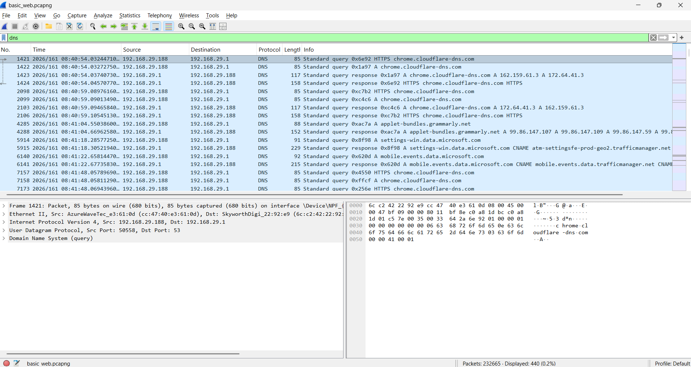
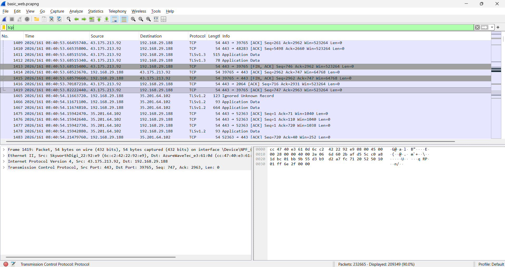
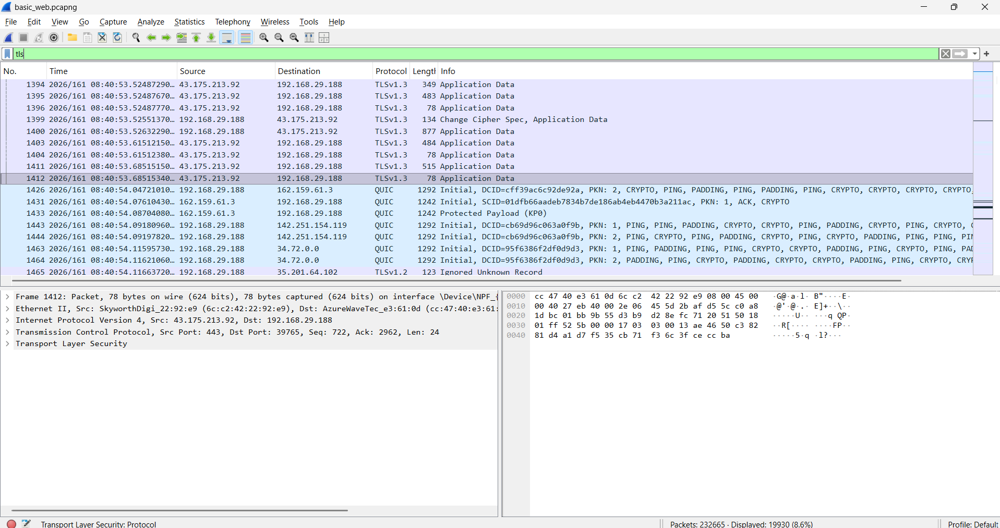

# Wireshark Traffic Analysis

## Objective

The objective of this project was to capture and analyze network traffic using Wireshark and identify common protocols used during normal web browsing activities.

## Tools Used

- Wireshark
- Windows 11

## Protocols Analyzed

### DNS (Domain Name System)
DNS traffic was analyzed to observe how domain names are translated into IP addresses before communication begins.

### TCP (Transmission Control Protocol)
TCP packets were examined to understand reliable network communication and connection management between hosts.

### TLS (Transport Layer Security)
TLS traffic was analyzed to identify encrypted HTTPS communications and secure data transmission.

## Analysis Performed

### DNS Analysis
- Captured DNS queries and responses.
- Observed hostname resolution processes.
- Identified domains such as Cloudflare DNS, Microsoft services, and Grammarly.

### TCP Analysis
- Examined TCP communication between the local machine and external servers.
- Identified ACK and FIN-ACK packets.
- Observed reliable connection establishment and termination.

### TLS Analysis
- Observed TLSv1.2 and TLSv1.3 encrypted traffic.
- Verified secure HTTPS communications.
- Confirmed that application data was encrypted.

## Key Findings

- DNS requests successfully resolved domain names to IP addresses.
- TCP sessions provided reliable communication between hosts.
- TLS encryption protected web traffic from direct inspection.
- No suspicious network activity was observed during the capture period.

## Skills Demonstrated

- Packet Capture
- Network Traffic Analysis
- DNS Investigation
- TCP Analysis
- TLS Inspection
- Network Monitoring
- Cybersecurity Documentation

## Screenshots

### DNS Traffic Analysis

### TCP Traffic Analysis

### TLS Traffic Analysis

## Conclusion

This project demonstrates the ability to capture, filter, and analyze network traffic using Wireshark. The analysis provided insight into DNS resolution, TCP communication, and encrypted TLS traffic, which are fundamental concepts in network security and SOC operations.

